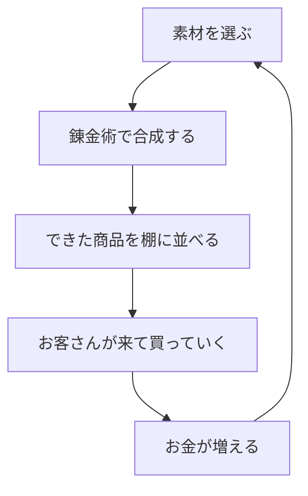
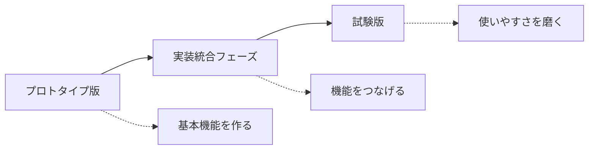
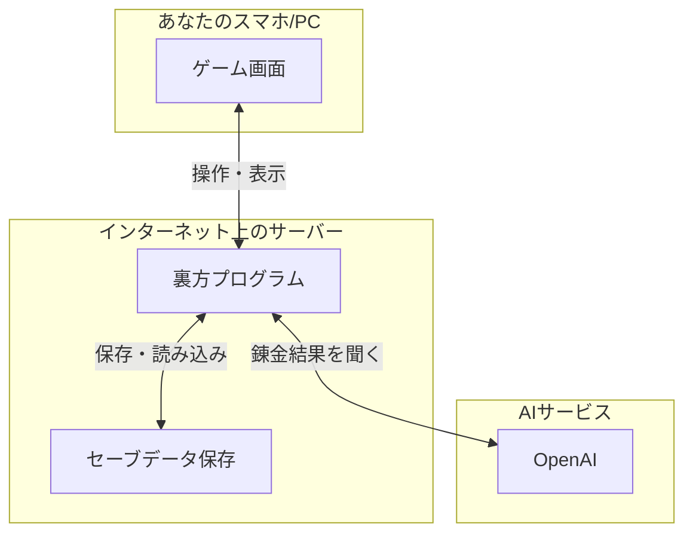
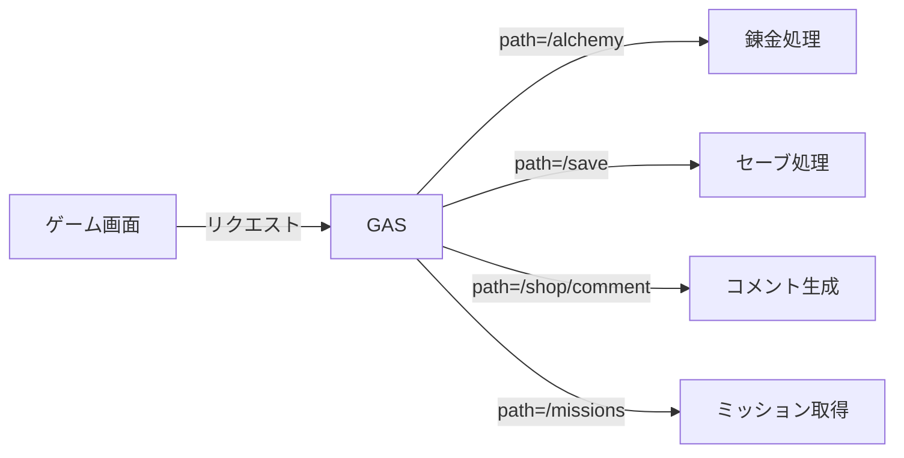
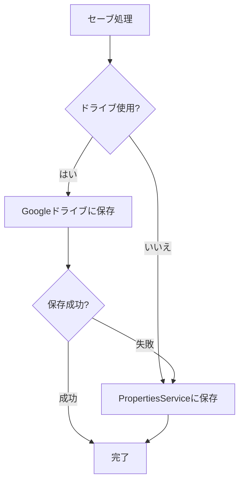

# 錬金術シミュレータ 開発のあゆみ（やさしい解説版）

> このドキュメントは「開発記録.md」の内容を、開発初心者の方にも分かりやすいようにかみ砕いて解説したものです。

---

## はじめに：このドキュメントについて

このドキュメントでは、「錬金術シミュレータ」というゲームがどのように作られ、どんな問題があって、どう改善されてきたかを説明します。

プログラミングや開発の専門用語はできるだけ使わず、使う場合は分かりやすく解説を加えています。

**このドキュメントで学べること:**
- ゲームの仕組みと遊び方
- 開発中に起きた問題と解決方法
- AIへの指示（プロンプト）の具体例
- Google Apps Script（GAS）のデプロイ方法
- AIモデルの選び方と設定

---

## このゲームってどんなゲーム？

### ひとことで言うと

**「錬金術師になって、薬や道具を作り、お店で売って稼ぐゲーム」** です。

### ゲームの流れ



例えば、こんな感じで遊びます：

1. **素材を選ぶ** - 「薬草」と「水」を選ぶ
2. **錬金する** - 釜に入れて混ぜると「回復薬」ができる
3. **お店に並べる** - できた回復薬を商品棚に置く
4. **お客さんが買う** - 回復薬が欲しいお客さんが来て、自動で買っていく
5. **お金をもらう** - 売れた分だけゴールド（G）が増える

このサイクルをぐるぐる回して、お店を大きくしていくのが基本の遊び方です。

### このゲームの特徴

| できること | 説明 |
|-----------|------|
| 自由な錬金 | 決まったレシピだけでなく、いろんな組み合わせを試せる。AIが結果を判定してくれる |
| 基本素材は無限 | 水や薬草などの基本素材は無限に使えるので、気軽に実験できる |
| 自動販売 | お客さんは勝手に来て、条件が合えば勝手に買ってくれる |
| 案内役がいる | 「ピペット」というキャラクターが、次に何をすればいいか教えてくれる |

---

## 開発で起きた問題と、どう解決したか

ゲーム開発では、最初に作ったものがそのまま完成品になることはほとんどありません。実際に遊んでみると「ここが分かりにくい」「これは面倒くさい」という問題が見つかります。

このゲームでも、開発の途中でいくつかの大きな問題が見つかりました。

### 最初のバージョンで困ったこと

#### 問題1：レシピが決まっていて、失敗ばかり

最初のバージョンでは、「薬草 + 水 = 回復薬」のように、正解の組み合わせが決まっていました。

- 正解以外の組み合わせは全部「失敗」
- 何度やっても失敗すると、やる気がなくなる
- 「正解を探す」だけのゲームになってしまう

#### 問題2：やることが多すぎて分かりにくい

- 素材を買わないといけない
- ミッション（お題）をクリアしないといけない
- 画面をあちこち移動しないといけない

初めて遊ぶ人は「結局何をすればいいの？」と迷ってしまいました。

#### 問題3：専門用語が多い

ゲーム内で使われている言葉が難しくて、何を意味しているか分からないという声がありました。

---

### 「複雑すぎる」から「シンプルで楽しい」への転換

これらの問題を解決するために、ゲームの方針を大きく変えました。

#### 変更1：AIで「なんでも結果が出る」ように

```
【変更前】決まったレシピ以外は全部失敗
    ↓
【変更後】どんな組み合わせでも、AIが何かしらの結果を返す
```

例えば「石 + 水」という組み合わせでも、AIが「濡れた石」のような結果を考えてくれます。失敗がなくなり、「何ができるかな？」というワクワク感が生まれました。

#### 変更2：基本素材を無限に

```
【変更前】素材はお金を払って買う必要がある
    ↓
【変更後】基本的な素材（水、薬草など）は無限に使える
```

お金がなくて詰むことがなくなり、気軽にいろんな錬金を試せるようになりました。

#### 変更3：1つの画面で完結

```
【変更前】錬金画面、お店画面、素材購入画面…と移動が多い
    ↓
【変更後】メイン画面だけでほぼ全部できる
```

画面移動のストレスがなくなり、テンポよく遊べるようになりました。

#### 変更4：「次に何をすればいいか」を分かりやすく

- 押すべきボタンを目立たせる
- 「ピペット」というキャラクターがヒントを出す
- 何かが起きたら画面に通知（お知らせメッセージ）が出る

> **「トースト通知」って何？**
> 
> スマホでLINEのメッセージが届いたとき、画面の上にピョコッとお知らせが出ますよね。あれと同じで、ゲーム内で何かが起きたとき（商品が売れた、など）に一瞬だけ表示されるお知らせのことを「トースト通知」と呼びます。パンがトースターから飛び出すイメージです。

---

### 開発の3つの段階

このゲームは、大きく3つの段階を経て作られました。



| 段階 | やったこと | 主な成果 |
|------|-----------|---------|
| プロトタイプ版 | 基本的な機能を作る | 錬金ができるようになった |
| 実装統合フェーズ | バラバラの機能を1つの流れにする | 「錬金→販売→お金」の流れが完成 |
| 試験版 | 使いやすさを改善する | ボタンの強調、通知、案内役の追加 |

---

## 今のゲームの遊び方

現在のゲームでできることを、もう少し詳しく説明します。

### 錬金のやり方

1. **素材を2つ選ぶ** - 基本素材は無限に使える
2. **ペースを選ぶ** - 「ゆっくり」「普通」「はやい」の3種類
3. **作る個数を決める** - 1〜20個
4. **錬金ボタンを押す** - AIが結果を判定

### 素材について

| 種類 | 説明 |
|------|------|
| 基本素材 | 水、薬草など。無限に使える |
| 作成物 | 錬金で作ったもの。数に限りがある |

作成物は2つの使い道があります：
- **お店で売る** - 商品棚に並べてお客さんに買ってもらう
- **錬金の材料にする** - さらに高度なアイテムを作る

### お店の運営

1. **商品を棚に並べる** - 作った商品を「商品だな」に配置
2. **開店する** - お客さんが来るようになる
3. **自動販売** - 条件が合えばお客さんが勝手に買っていく
4. **売上を確認** - いくら稼いだか、何が売れたかを確認

### お客さんについて

お客さんはそれぞれ「欲しいもの」と「予算」を持っています。

- 欲しいカテゴリの商品がある → 買う
- 欲しいものがない or 予算オーバー → 買わずに帰る

買ってもらえたとき、買ってもらえなかったときは、画面に通知が出るので分かりやすくなっています。

---

## 使っている技術をやさしく解説

このゲームがどんな技術で動いているか、専門用語を使わずに説明します。

### ゲームを動かす仕組みの全体像



### 見える部分（画面）

あなたがスマホやパソコンで見ている画面は、「React」（リアクト）という技術で作られています。

> **Reactとは？**
> 
> Webサイトやアプリの画面を作るための道具です。ボタンを押したときの反応や、画面の表示切り替えなどを担当しています。

### 見えない部分（裏方）

ゲームのデータを保存したり、いろんな処理をする裏方部分は「Google Apps Script」（GAS）という技術で作られています。

> **Google Apps Scriptとは？**
> 
> Googleが提供しているプログラムを動かす仕組みです。Googleドライブにセーブデータを保存したりできます。

### AIの役割

このゲームでは「OpenAI」のAIを使っています。

AIがやっていること：
- **錬金結果の判定** - 「薬草 + 水 = ？」の答えを考える
- **お客さんのコメント生成** - お客さんのセリフを作る
- **ミッションの生成** - 今日のお題を毎日考える
- **アイコンの生成** - アイテムの見た目を作る

> **なぜAIを使う？**
> 
> 全ての素材の組み合わせパターンを人間が考えて登録するのは大変です。AIを使えば、どんな組み合わせでも「それっぽい」結果を自動で考えてくれます。

---

## AIモデルの選定と設定

### 採用しているAIモデル

このゲームでは、**速度を重視して `gpt-5-mini` を採用**しています。

| 用途 | 使用モデル | 選定理由 |
|------|-----------|---------|
| 錬金結果生成 | gpt-5-mini | 素早いレスポンスでテンポ良く遊べる |
| お客さんのコメント | gpt-5-mini | 短文生成なので軽量モデルで十分 |
| ミッション生成 | gpt-5-mini | 1日1回なのでキャッシュ併用 |
| アイコン生成 | gpt-5-mini | シンプルな図形なので軽量モデルで対応 |

> **なぜ gpt-5-mini を選んだ？**
> 
> - **速度**: ゲームはテンポが命。待ち時間が長いとストレスになる
> - **コスト**: 大量のリクエストがあるゲームでは、安いモデルが経済的
> - **品質**: 錬金結果やコメント程度なら、軽量モデルでも十分な品質

### モデルの設定方法

AIモデルは設定で変更できます。`backend/Config.gs` で設定を読み込んでいます：

```javascript
getOpenAiModel: function() {
  return PropertiesService.getScriptProperties().getProperty('OPENAI_MODEL') || 'gpt-5-mini';
},
```

スクリプトプロパティで `OPENAI_MODEL` を設定すれば、モデルを変更できます。

---

## AIプロンプトの具体例

AIに「何をしてほしいか」を伝える文章を「プロンプト」と呼びます。このゲームでは、状況に応じて様々なプロンプトを使い分けています。

### 例1: 錬金結果を生成するプロンプト

**こういう時に使う**: プレイヤーが2つの素材を釜に入れて錬金したとき

```
錬金術シミュレータのゲームで、2つの素材を調合した結果を1つ生成してください。
素材1: 薬草 (id: herb)
素材2: 水 (id: water)
錬金スピード: ゆっくり (slow)
※スピードが「ゆっくり」ほど高品質・高ティアの結果にし、「素早く」ほど簡単な結果にしてください。
ファンタジー錬金術の世界観で、素材の組み合わせから自然な結果を考えてください。
結果アイテムにはiconに絵文字1つを付けてください。
category は food|weapon|medicine|gem のいずれか1つを必ず返してください。
必ず以下のJSON形式のみで返してください（他テキストなし）:
{"result":{"id":"healing_potion","name":"回復薬","icon":"💊","quality":"fine","description":"傷を癒す薬","value":500,"tier":1,"category":"medicine","isNewRecipe":true},"byproduct":null}
```

**ポイント解説:**
- `素材1`, `素材2` で何を混ぜたかを伝える
- `錬金スピード` でクオリティの目安を指示
- `JSON形式` で返すよう指定することで、プログラムで扱いやすくなる

### 例2: お客さんのコメントを生成するプロンプト

**こういう時に使う**: お客さんが商品を買った/買わずに帰ったとき

```
あなたはファンタジー世界の買い物客です。錬金術工房での接客直後に表示する、お客様の一言コメントを日本語で1つ作成してください。
ゲームUI用の短文ですが、定型文ではなく、その場の体験が伝わる表現にしてください。
40〜85文字程度。絵文字は使わない。丁寧口調で自然な話し言葉。
「{工房名}で{商品}をX個買えました」のような固定パターンは避ける。
購入できた/できなかった結果だけでなく、来店理由・雰囲気・次の行動・品質感のどれかを1つ以上入れる。
大げさな賛辞、説明調、メタ発言（AI/生成など）は禁止。

工房名: ひまわり工房
お客様名: 旅の商人マルコ
希望カテゴリ: 薬
結果: 購入成功
購入した商品: 回復薬
購入数: 3個
合計金額: 1500G

返答は必ずJSONのみ。形式: {"comment":"..."}
```

**ポイント解説:**
- `避けるべきパターン` を明記して、つまらない定型文を防ぐ
- `禁止事項` を書くことで、不自然な表現を避ける
- `文字数指定` でUIに収まる長さに調整

### 例3: ミッションを生成するプロンプト

**こういう時に使う**: 毎日のログイン時に新しいお題を作るとき

```
錬金術シミュレータのゲーム用に、今日のミッションを3つ生成してください。
依頼はすべて「〇〇を1個納品してほしい」のように、1個納品形式で統一してください。
種類は以下をバラけて：納品依頼型（例：傷を癒す薬を1個納品してほしい）、発見型（新しい〇〇系アイテムを発見する）。
ファンタジー錬金術の世界観で、薬、炎、宝石、毒、聖水、剣などが登場する依頼にしてください。
rewardG は 2000〜6000 の範囲で難易度に応じて設定。
必ず以下のJSON形式で返してください（他テキストなし）：
{"missions":[{"id":"m1","title":"タイトル","description":"依頼の詳細","rewardG":3000},{"id":"m2",...},{"id":"m3",...}]}
```

**ポイント解説:**
- `種類をバラけて` で多様性を持たせる
- `報酬の範囲` を指定して、ゲームバランスを保つ
- `例` を入れることで、AIが具体的なイメージを持てる

### 例4: 依頼達成時の判定プロンプト

**こういう時に使う**: プレイヤーがミッションにアイテムを納品したとき

```
錬金術シミュレータのゲームで、依頼に対する納品の達成度を判定してください。
依頼: 傷を癒す薬を1個納品してほしい
納品されたアイテム: 解毒薬

達成度に応じて報酬倍率を0.5〜1.5で設定してください。
- ぴったり一致なら1.2〜1.5
- 関連するが少しずれていれば0.8〜1.0
- 無関係なら0.5〜0.7

必ず以下のJSON形式のみで返してください（他テキストなし）:
{"score":85,"multiplier":1.2}
```

**ポイント解説:**
- `倍率の基準` を明確にして、AIが判断しやすくする
- 完全一致でなくても部分点がもらえる仕組み

### プロンプト設計のコツ

| コツ | 説明 | 例 |
|------|------|-----|
| 役割を与える | AIに「あなたは〇〇です」と伝える | 「あなたはファンタジー世界の買い物客です」 |
| 具体例を示す | 期待する出力の例を見せる | `{"id":"m1","title":"...",}` |
| 禁止事項を明記 | やってほしくないことを書く | 「大げさな賛辞は禁止」 |
| 数値の範囲を指定 | 金額や文字数を制限する | 「40〜85文字程度」「2000〜6000G」 |
| JSON形式を指定 | プログラムで扱いやすくする | 「必ずJSON形式のみで返してください」 |

---

## Google Apps Script（GAS）のデプロイ方法

「デプロイ」とは、作ったプログラムをインターネット上で使えるようにすることです。

### GASとは？

Google Apps Script（GAS）は、Googleが無料で提供しているプログラム実行環境です。

**GASを使うメリット:**
- 無料で使える
- サーバーの管理が不要
- Googleドライブと連携しやすい
- APIキーを安全に保管できる

### ステップ1: GASプロジェクトを作成する

1. [Google Apps Script](https://script.google.com) にアクセス
2. 「新しいプロジェクト」をクリック
3. プロジェクト名を「錬金術シミュレータ」などに変更

### ステップ2: コードをコピーする

`backend/` フォルダにある `.gs` ファイルをGASエディタにコピーします。

```
backend/
├── Main.gs        ← 入口（リクエストの振り分け）
├── Config.gs      ← 設定の読み込み
├── Utils.gs       ← 共通の便利機能
├── Auth.gs        ← ログイン処理
├── Save.gs        ← セーブデータの読み書き
├── Drive.gs       ← Googleドライブ操作
├── Alchemy.gs     ← 錬金処理
├── Shop.gs        ← 接客コメント生成
├── Missions.gs    ← ミッション管理
├── Market.gs      ← 市場機能
├── SvgIcon.gs     ← アイコン生成
└── Recipes.gs     ← レシピ管理
```

### ステップ3: スクリプトプロパティを設定する

スクリプトプロパティとは、APIキーなどの秘密情報を安全に保存する場所です。

**設定方法:**
1. GASエディタで「プロジェクトの設定」（歯車アイコン）をクリック
2. 「スクリプトプロパティ」セクションで「プロパティを追加」

**必要なプロパティ:**

| プロパティ名 | 説明 | 設定例 |
|--------------|------|--------|
| `OPENAI_API_KEY` | OpenAIのAPIキー | `sk-xxxxx...` |
| `OPENAI_MODEL` | 使用するAIモデル | `gpt-5-mini` |
| `SAVE_FOLDER_ID` | 保存先フォルダID（空でもOK） | `1abc...xyz` |
| `SAVE_USE_DRIVE` | ドライブ使用の有無 | `true` または `false` |

### ステップ4: Webアプリとしてデプロイする

1. 「デプロイ」→「新しいデプロイ」をクリック
2. 種類で「ウェブアプリ」を選択
3. 設定:
   - **実行ユーザー**: 「自分」
   - **アクセスできるユーザー**: 「全員」
4. 「デプロイ」をクリック
5. 表示されたURLをコピー

### ステップ5: フロントエンドに設定する

デプロイで取得したURLを、フロントエンドの設定ファイルに記載します。

`frontend/.env` ファイル:
```
VITE_GAS_URL=https://script.google.com/macros/s/YOUR_SCRIPT_ID/exec
```

### デプロイ時の注意点

- **URLは変更される**: 新しいバージョンをデプロイするたびにURLが変わることがある
- **権限の許可**: 初回デプロイ時にGoogleアカウントの権限許可が必要
- **テスト方法**: ブラウザで `デプロイURL?path=/authorize` にアクセスして動作確認

---

## APIエンドポイント一覧

「エンドポイント」とは、外部からアクセスできる窓口のことです。



### 主なエンドポイント

| パス | 役割 | 使うタイミング |
|------|------|---------------|
| `/auth` | ログイン | ゲーム開始時 |
| `/save` | セーブ読み書き | ゲーム中随時 |
| `/alchemy` | 錬金実行 | 素材を合成するとき |
| `/shop/comment` | コメント生成 | お客さんが来店したとき |
| `/missions` | ミッション取得 | ログイン時 |
| `/market` | 市場情報取得 | マーケット画面表示時 |

---

## セーブデータの仕組み

### 保存先の優先順位

セーブデータは2つの場所に保存できます：

1. **Googleドライブ（優先）**: 容量が大きい、長期保存向け
2. **PropertiesService（予備）**: 容量制限あり（9KB）、簡易保存向け



### セーブデータの中身

```javascript
{
  userId: "u_abc123...",           // ユーザー識別ID
  userName: "たろう",              // プレイヤー名
  workshopName: "ひまわり工房",    // 工房名
  g: 5000,                         // 所持金（ゴールド）
  inventory: [...],               // 持っているアイテム一覧
  recipes: [...],                 // 発見したレシピ一覧
  achievements: [...],            // 獲得した実績
  rank: 3,                        // 現在のランク
  lastLoginDate: "2026-03-02",    // 最後にログインした日
  alchemyCount: 42,               // 錬金した回数
  dailySalesLedger: {             // 今日の売上記録
    date: "2026-03-02",
    totalG: 3500,
    entries: [...]
  }
}
```

---

## トラブルシューティング

開発中によくある問題と、その解決方法をまとめました。

### 問題1: AIの返答が想定と違う

**症状**: 錬金結果が変な名前になる、カテゴリが間違っている

**解決方法**: プロンプトに制約を追加する

```
【変更前】
結果アイテムを生成してください。

【変更後】
結果アイテムを生成してください。
category は food|weapon|medicine|gem のいずれか1つを必ず返してください。
必ずJSON形式のみで返してください（他テキストなし）。
```

### 問題2: AIの応答が遅い

**症状**: 錬金ボタンを押してから結果が出るまで時間がかかる

**解決方法**: 軽量なモデルに変更する

```javascript
// Config.gs のスクリプトプロパティで設定
OPENAI_MODEL = "gpt-5-mini"  // 高速モデルを使用
```

### 問題3: セーブデータが保存されない

**症状**: ゲームを閉じると進行がリセットされる

**解決方法**: 
1. スクリプトプロパティの `SAVE_USE_DRIVE` を確認
2. Googleドライブの権限を確認
3. `SAVE_FOLDER_ID` が正しいか確認

### 問題4: GASデプロイ後にエラーが出る

**症状**: ゲーム画面で「接続エラー」が表示される

**チェックリスト:**
- [ ] デプロイURLをフロントエンドの `.env` に正しく設定したか
- [ ] スクリプトプロパティに `OPENAI_API_KEY` を設定したか
- [ ] デプロイ時に「全員がアクセス可能」を選んだか
- [ ] 最新バージョンをデプロイしたか（古いバージョンが残っていないか）

---

## まとめ

### このゲームが大事にしていること

1. **シンプルさ** - 1つの画面で遊べる、次にやることが分かる
2. **自由さ** - どんな組み合わせでも結果が出る、失敗がない
3. **テンポの良さ** - 画面移動が少ない、自動で売れる
4. **AIの活用** - 人間が全パターンを作るのではなく、AIに任せる

### 開発で学んだこと

- 最初から完璧なものは作れない
- 実際に使ってみないと問題は分からない
- 「複雑で高機能」より「シンプルで分かりやすい」が大事
- AIモデルは用途に応じて使い分ける（速度重視 vs 品質重視）
- プロンプトは具体的に書くほど良い結果が得られる

### 技術選定のポイント

| 選定項目 | 選んだもの | 理由 |
|----------|-----------|------|
| AIモデル | gpt-5-mini | 速度とコストのバランスが良い |
| バックエンド | Google Apps Script | 無料、サーバー管理不要 |
| データ保存 | Googleドライブ | 大容量、信頼性が高い |
| フロントエンド | React + Vite | 開発効率が良い、高速 |

---

## 用語集

| 用語 | 意味 |
|------|------|
| プロトタイプ | 試作品。まず動くものを作って試すこと |
| UI（ユーアイ） | 画面のデザインやボタンの配置など、見た目のこと |
| UX（ユーエックス） | 使いやすさ、遊びやすさ。ユーザーの体験全体のこと |
| API（エーピーアイ） | プログラム同士がやり取りする窓口 |
| フロントエンド | ユーザーが直接見る・触る部分（画面） |
| バックエンド | ユーザーからは見えない裏側の処理 |
| トースト通知 | 画面に一瞬だけ出るお知らせメッセージ |
| 状態管理 | 「今どうなっているか」を覚えておく仕組み |
| プロンプト | AIに「何をしてほしいか」を伝える文章 |
| デプロイ | 作ったプログラムをインターネット上で使えるようにすること |
| エンドポイント | 外部からアクセスできる窓口（URL） |
| JSON | データをやり取りするための書き方のルール |
| スクリプトプロパティ | GASで秘密情報を安全に保存する場所 |
| キャッシュ | 同じ処理を繰り返さないために一時的に保存するデータ |
| gpt-5-mini | OpenAIの軽量・高速なAIモデル |

---

## 参考リンク

- [Google Apps Script 公式ドキュメント](https://developers.google.com/apps-script)
- [OpenAI API ドキュメント](https://platform.openai.com/docs)
- [React 公式サイト](https://react.dev/)

---

> 元ドキュメント: [開発記録.md](./開発記録.md)
> 
> 最終更新: 2026-03-02
